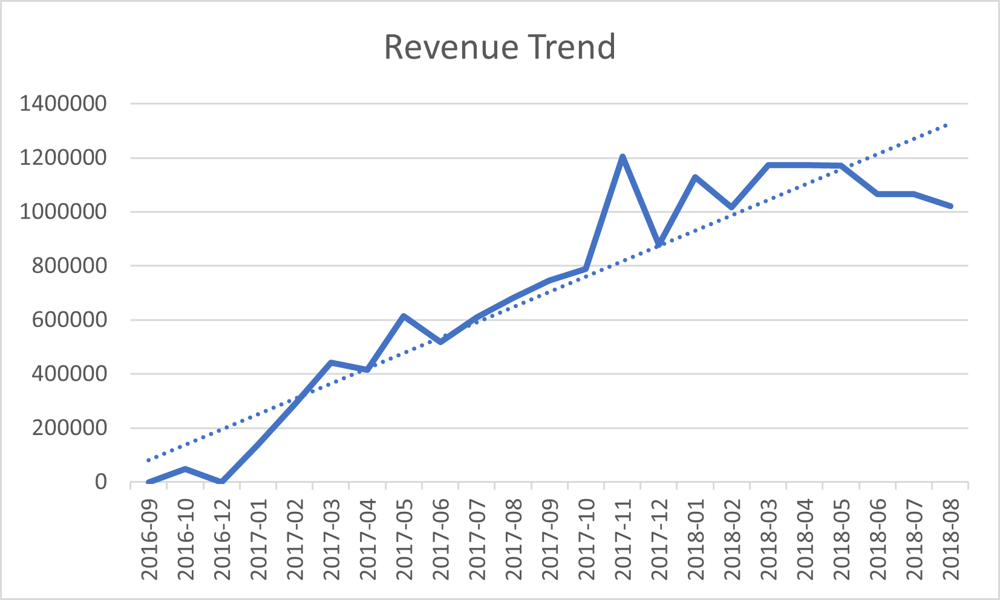
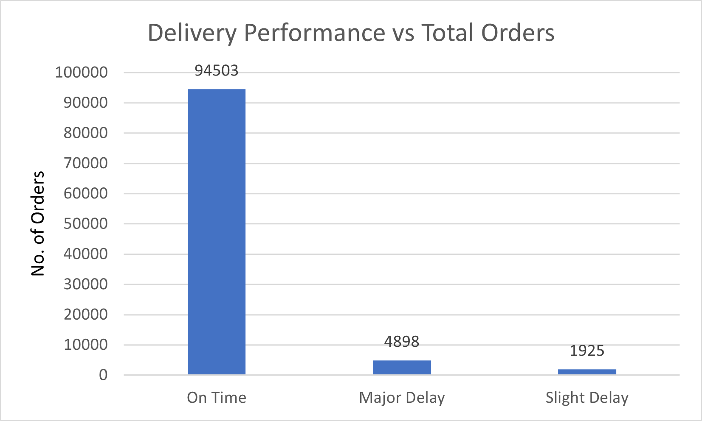
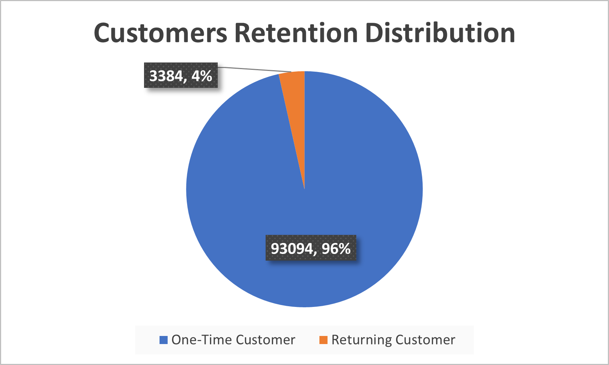
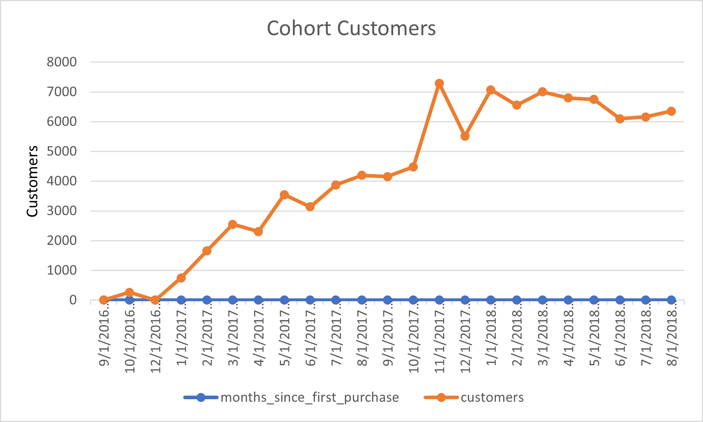
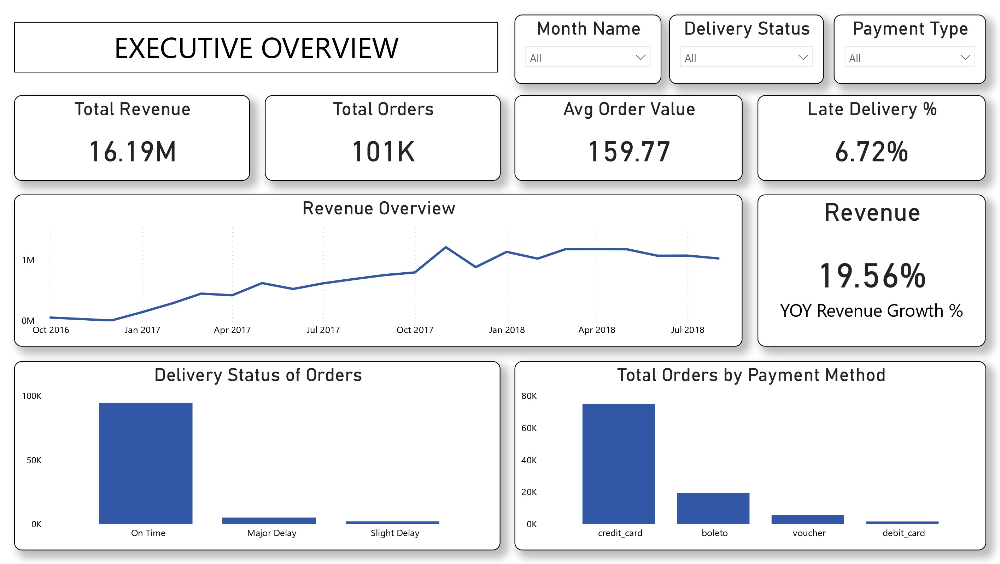
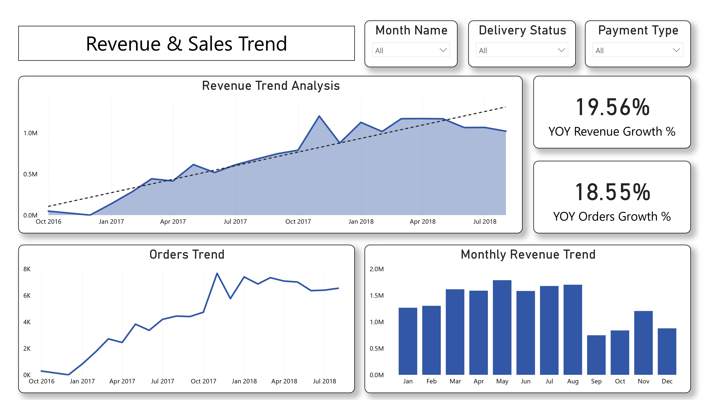
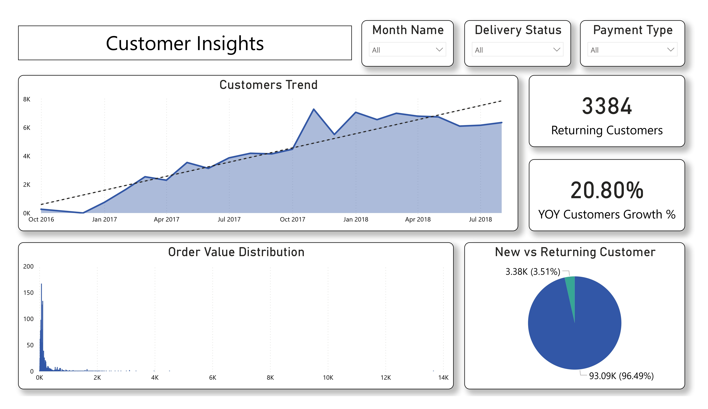
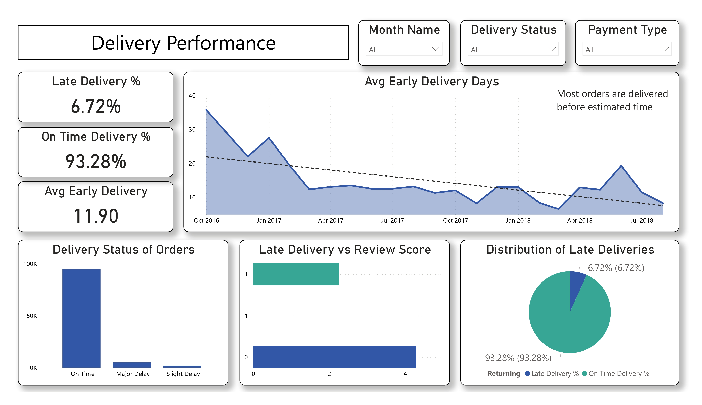

# 📊 E-Commerce Analytics Project (Olist Dataset)

---

## 📌 Table of Contents

1. [📖 Project Overview](#-project-overview)  
2. [🎯 Project Objectives](#-project-objectives)  
3. [🛠️ Tools & Technologies](#️-tools--technologies)  
4. [📂 Data Description](#-data-description)  
5. [⚙️ Data Preparation & Engineering](#️-data-preparation--engineering)  
6. [📊 SQL Business Analysis](#-sql-business-analysis)  
7. [📈 Exploratory Data Analysis](#-exploratory-data-analysis)  
8. [📉 Hypothesis Testing](#-hypothesis-testing)  
9. [📊 Power BI Dashboard](#-power-bi-dashboard)  
10. [🔍 Key Insights](#-key-insights)  
11. [📌 Business Impact](#-business-impact)  
12. [🚀 Conclusion](#-conclusion)  
13. [📁 Repository Structure](#-repository-structure)
14. [👨‍💻 Authors and Contact](#-authors-and-contact)

---

## 📖 Project Overview

This project presents an **end-to-end e-commerce analytics solution** using the Brazilian Olist dataset.

It integrates **SQL, Python, and Power BI** to analyze customer behavior, revenue trends, and delivery performance, transforming raw transactional data into **actionable business insights**.

---

## 🎯 Project Objectives

1. Analyze **revenue trends and growth patterns**  
2. Evaluate **delivery performance and its impact on customer satisfaction**  
3. Understand **customer behavior and retention patterns**  
4. Build **interactive dashboards for decision-making**  
5. Apply **statistical methods to validate business assumptions**

---

## 🛠️ Tools & Technologies

- **SQL (Google BigQuery)** → Data transformation & business analysis  
- **Python (Pandas, Matplotlib, Seaborn, SciPy)** → EDA & statistical testing  
- **Power BI** → Interactive dashboard development  
- **Jupyter Notebook / Colab** → Analysis & documentation  

---

## 📂 Data Description

The dataset contains **100K+ e-commerce transactions**, including:

- Order details  
- Customer information  
- Payment data  
- Delivery timestamps  
- Review scores  

A consolidated dataset (`master_orders_features`) was created to enable **efficient analysis and visualization**.

---

## ⚙️ Data Preparation & Engineering

1. Built **modular SQL views** for delivery, revenue, payments, and reviews  
2. Created a **master dataset** by joining multiple tables  
3. Engineered features such as:
   - Delivery delay (days)
   - Late delivery flag
   - High-value orders  
4. Exported clean dataset for analysis and dashboarding  

---

## 📊 SQL Business Analysis

### 1️⃣ Revenue Trend Analysis  
- Monthly revenue growth  
- Identification of peak business periods  



---

### 2️⃣ Delivery Performance  
- On-time vs delayed deliveries  
- Operational efficiency evaluation  



---

### 3️⃣ Customer Retention  
- One-time vs returning customers  
- Retention gap identification  



---

### 4️⃣ Customer Acquisition Trend  
- Growth in new customers over time  



---

## 📈 Exploratory Data Analysis

Performed in Python to understand:

- Distribution of order values  
- Review score patterns  
- Delivery delay behavior  
- Relationships between key variables  

---

## 📉 Hypothesis Testing

### 1️⃣ Delivery Delay vs Review Score  
Late deliveries significantly reduce customer satisfaction  

### 2️⃣ Payment Method vs Order Value  
Credit card users tend to spend more  

### 3️⃣ Payment Type vs Order Value (ANOVA)  
Significant differences exist across payment methods  

### 4️⃣ Order Value vs Freight Cost (Correlation)  
Moderate positive relationship identified  

---

## 📊 Power BI Dashboard

### 1️⃣ Executive Overview  
- KPIs: Revenue, Orders, AOV, Late Delivery %  
- Revenue trend visualization  



---

### 2️⃣ Revenue & Trends  
- Revenue growth analysis  
- Year-over-Year comparison  



---

### 3️⃣ Customer Insights  
- Customer distribution and behavior  
- Order value patterns  



---

### 4️⃣ Delivery Performance  
- Delivery efficiency metrics  
- Impact on customer satisfaction  



---

## 🔍 Key Insights

1. **Revenue Growth 📈**  
   Strong growth observed throughout 2017, stabilizing in 2018  

2. **Customer Retention ⚠️**  
   Majority of customers are one-time buyers  

3. **Delivery Performance 🚚**  
   Most orders delivered early, but delays reduce ratings  

4. **Payment Behavior 💳**  
   Credit cards dominate and drive higher value orders  

---

## 📌 Business Impact  

- Built an end-to-end analytics solution on 100K+ e-commerce records, improving business visibility by tracking 5+ KPIs using SQL, Python (EDA), and Power BI  

- Identified impact of delivery delays on customer satisfaction by detecting ~2.0 point drop in review scores using hypothesis testing (t-test, p < 0.05)  

- Uncovered revenue growth patterns and customer behavior insights by performing SQL-based analysis and EDA, highlighting that 90K+ customers (~96%) were one-time buyers  

- Quantified customer spending behavior by finding ~21 BRL higher average order value for credit card users and a moderate correlation (~0.49) between order value and freight cost  

- Enabled data-driven decision making by integrating SQL, Python (EDA & statistical testing), and Power BI dashboards to generate actionable insights  

---

## 🚀 Conclusion

This project demonstrates how raw e-commerce data can be transformed into **meaningful business insights** using a structured analytics workflow.

By combining **data engineering, statistical analysis, and visualization**, it highlights:

- Growth trends  
- Operational inefficiencies  
- Customer behavior patterns  

---

## 📁 Repository Structure


```
ecommerce-analytics-project/
│
├── data/
│   ├── raw/                         # ignored
│   ├── processed/
│   │   └── master_orders_features.csv
│   └── analytics/
│       ├── 07_01_revenue_trend.csv
│       ├── 07_02_delivery_performance.csv
│       ├── 07_03_customer_retention.csv
│       └── 07_04_cohort_analysis.csv
│
├── sql/
│   ├── 01_create_delivery_view.sql
│   ├── 02_create_revenue_view.sql
│   ├── 03_create_review_view.sql
│   ├── 04_create_payment_view.sql
│   ├── 05_create_master_table.sql
│   ├── 06_feature_engineering.sql
│   ├── 07_01_revenue_trend.sql
│   ├── 07_02_delivery_performance.sql
│   ├── 07_03_customer_retention.sql
│   ├── 07_04_cohort_analysis.sql
│   └── 08_export_master_orders_features.sql
│
├── notebooks/
│   ├── 01_eda.ipynb
│   ├── 02_hypothesis_testing.ipynb
│   └── 03_sql_business_analysis.ipynb
│
├── dashboard/
│   ├── olist_dashboard.pbix
│   ├── Business_Performance_Dashboard.pptx
│   └── olist_dashboard.pdf
│
├── images/
│   ├── sql_outputs/                 # from BigQuery 
│   │   ├── 07_01_revenue_trend.png
│   │   ├── 07_02_delivery_performance.png
│   │   ├── 07_03_customer_retention.png
│   │   └── 07_04_cohort_analysis.png
│   │
│   └── dashboard/                  # Power BI screenshots
│       ├── 01_executive_overview.jpg
│       ├── 02_revenue_trends.jpg
│       ├── 03_customer_insights.jpg
│       └── 04_delivery_performance.jpg
│
├── .gitignore
├── requirements.txt
└── README.md
```

---

## 👨‍💻 Author & Contact
**Author:** Mohd Walid Ansari  
**Email:** [walidmohd2532001@gmail.com](mailto:walidmohd2532001@gmail.com)  
**GitHub:** [mohdwalid253](https://github.com/mohdwalid253)   
**LinkedIn:** [Mohd Walid Ansari](https://www.linkedin.com/in/mohdwalidansari/)